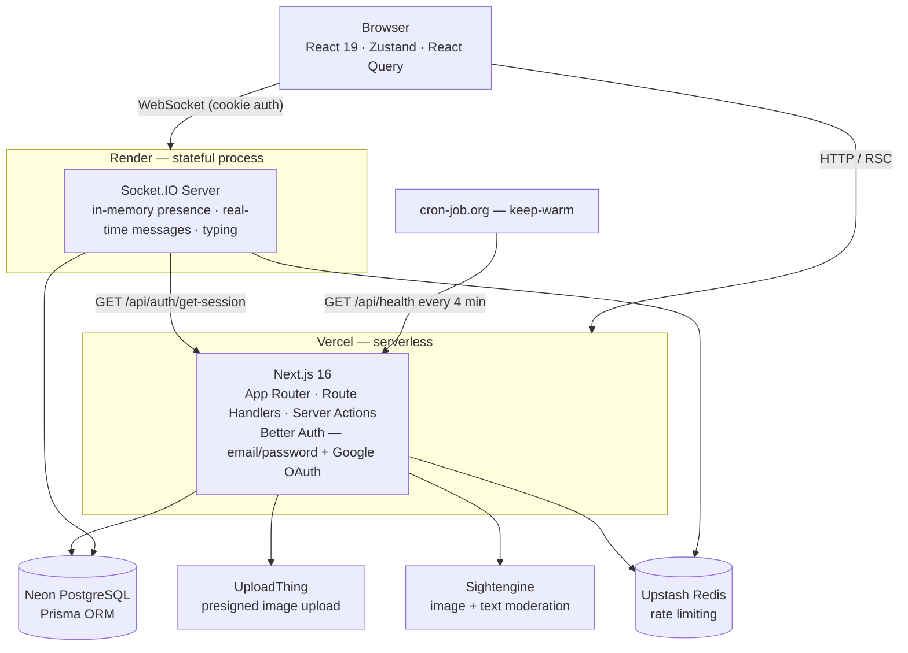

# CampusKart — Architecture

> For data flows, API contracts, and debugging lessons see [docs/](./docs/) — CODEBASE · API_FLOW · DECISIONS · DEBUGGING.

---

## System diagram



Two deploy targets because Vercel is serverless and cannot hold long-lived WebSocket connections.

---

## Data-access rules (strict)

| Operation | Where |
|-----------|-------|
| Reads (lists, details, pagination) | `src/app/api/**` Route Handlers, called by React Query v5 |
| Mutations (create, update, delete) | `src/actions/**` Server Actions, return `ApiResponse<T>` |
| Real-time (messages, typing, presence) | Socket.IO events only — never HTTP |

---

## Security invariants

**College scoping** — `collegeId` is always taken from `session.user.collegeId`, never from the client payload. It is denormalized onto `Listing`, `Store`, and `Conversation` for query performance. Detail handlers return 404 on college mismatch. Visibility is decided in one place — `src/lib/permissions.ts` (`canViewStore` / `canViewListing` / `canModerateCollege`): owner always; ADMIN across all colleges; MODERATOR own-college (any status); regular users own-college only (ACTIVE stores; ARCHIVED listings hidden).

**Socket sender trust** — `senderId` is never accepted from the socket client payload. The socket server sets `socket.data.userId` during handshake validation and uses that exclusively.

**Content moderation** — Both image and text are moderated synchronously inside the create/update Server Action, before any DB write. Text (`checkTextIsSafe`) runs first; images (`checkImagesAreSafe`) run second. A flagged result deletes the UploadThing files and returns `TEXT_FLAGGED` / `IMAGE_FLAGGED`. A provider error returns `MODERATION_UNAVAILABLE` (fail closed — listing not created, files kept for retry).

**Sold listing guard** — `POST /api/conversations` returns `409 LISTING_NOT_ACTIVE` if the listing is not `ACTIVE`. Contacting a seller about a sold item is blocked.

---

## Database models

```
User            — auth fields + username + collegeId + role (USER/MODERATOR/ADMIN)
College         — id, name, city, state
Session         — Better Auth managed
Account         — Better Auth managed
Verification    — Better Auth managed

Listing         — title, price, images[], category, condition, status (ACTIVE/SOLD/ARCHIVED),
                  listingType (FIXED_PRICE/NEGOTIABLE), sellerId, collegeId, storeId?
Conversation    — listingId?, storeId?, collegeId, lastMessageAt
ConversationParticipant — conversationId, userId, lastReadAt?, hiddenAt?
Message         — conversationId, senderId, content, createdAt

Store           — name, description, category, images[], phone?, whatsapp?, location?,
                  mapUrl?, hours?, quickReplies[], tags[], isVerified, status (PENDING/ACTIVE/ARCHIVED),
                  ownerId (unique — one store per user), collegeId
StoreReview     — storeId, userId (unique per store), rating (1–5), body?
ModerationLog   — moderatorId, listingId, listingTitle, sellerName, collegeId, reason?
```

---

## Auth and roles

Better Auth handles sessions (email/password + Google OAuth + username plugin). Custom fields: `collegeId`, `role`.

| Role | Access |
|------|--------|
| `USER` | all app features |
| `MODERATOR` | + admin panel scoped to their college (remove listings, verify/archive stores) |
| `ADMIN` | + admin panel across all colleges, moderation log, permanent store deletion |

All role and visibility checks route through one module — `src/lib/permissions.ts` (`isAdmin`, `canModerate`, `canModerateCollege`, `canViewStore`, `canViewListing`) — shared by pages, API route handlers, and server actions so the rules can't drift between surfaces.

`proxy.ts` (the `proxy` function, renamed from `middleware.ts` for Next.js 16) gates `(app)` routes by session cookie presence. Full session validation happens inside handlers/actions. The socket server re-validates the handshake cookie over HTTP against `/api/auth/get-session`.

---

## Image pipeline

```
1. Client compresses (browser-image-compression)
2. UploadThing presigned upload — bytes never touch our server
3. Server Action:
   checkTextIsSafe(title, description)
     → Sightengine text/check.json (POST, profanity/sexual/hate/violence/drug/weapon/extremism)
     → flagged  →  delete files + return TEXT_FLAGGED
     → throws   →  delete files + return MODERATION_UNAVAILABLE

   checkImagesAreSafe(urls)
     → Sightengine check.json (GET by image URL, up to 3 retries with 8s timeout)
     → score ≥ threshold  →  delete files via utapi + return IMAGE_FLAGGED
     → throws             →  delete files + return MODERATION_UNAVAILABLE
     → safe               →  db.listing.create / db.listing.update
```

---

## Stores flow

Students register one store per account (enforced at DB level with `ownerId @unique`). New stores start as `PENDING` and are invisible to other students. A MODERATOR or ADMIN verifies them (flips to `ACTIVE`) via the admin panel at `/admin/stores`. Archived stores are hidden; admins can permanently delete them.

Store listings (`Listing.storeId` set) are excluded from the main browse feed. `Conversation.storeId` links a chat thread to a store for store-based contact flows.

---

## Real-time / presence

- **In-memory only** — `Map<collegeId, Set<userId>>` + per-user socket count on the socket server. No `isOnline` DB column.
- `lastSeen` written to DB on the user's final disconnect (fire-and-forget).
- Messages persist + bump `conversation.lastMessageAt` atomically, then broadcast to the `conversation:<id>` room (sender included; client dedupes against optimistic copy).
- **Delete-for-me** — `hideConversation` sets `participant.hiddenAt`. `GET /api/conversations` filters hidden rows in JS: keeps a row only if `hiddenAt == null` or `lastMessageAt > hiddenAt` — so a hidden chat resurfaces automatically when the other person sends a new message.

---

## State management

| State type | Tool |
|-----------|------|
| Server data (listings, stores, messages) | React Query v5 — cursor-infinite where paginated |
| Real-time ephemeral (socket ref, online users, typing) | Zustand — minimal, no business data |
| Forms + validation | React Hook Form + Zod v4 |

---

## Rate limiting (Upstash Redis, sliding window)

| Limiter | Window | Keyed by | Where enforced |
|---------|--------|----------|----------------|
| sign-in | 10 / 15 min | IP | `proxy.ts` |
| sign-up | 5 / 15 min | IP | `proxy.ts` |
| listing create | 5 / 1 h | userId | `createListing` action |
| conversation create | 20 / 1 h | userId | `POST /api/conversations` |
| socket messages | 30 / 1 min | userId | `client:send_message` handler |

The socket message limiter **fails open** — if Redis is unavailable, messages are allowed through rather than blocking all chat.

---

## Deployment

| App | Platform | Notes |
|-----|----------|-------|
| Next.js app | Vercel | root of repo |
| Socket server | Render | point at `socket-server/` subdir; `PORT` injected by Render |

Set `NEXT_PUBLIC_SOCKET_URL` to the Render service URL and `BETTER_AUTH_URL` to the Vercel URL on both platforms. Socket server CORS is locked to `BETTER_AUTH_URL`.

> The socket server has its own `.env` file at `socket-server/.env`. It does **not** inherit the root `.env.local`. Both files must contain `DATABASE_URL`, `BETTER_AUTH_SECRET`, and the Upstash vars.

---

## Keep-warm

Neon free-tier suspends compute after ~5 min idle. The next request then cold-starts the DB, and because the first DB call on every page is `getSession`, that wait can exceed the Vercel function limit and crash the server component with a connection timeout. A [cron-job.org](https://cron-job.org) schedule pings `GET /api/health` every 4 minutes to keep the compute warm. The route runs `SELECT 1`, is `force-dynamic` (never cached), and returns `{ ok, db }`. `(app)/error.tsx` is a graceful boundary so any rare cold start shows a "Try again" instead of a raw crash.
