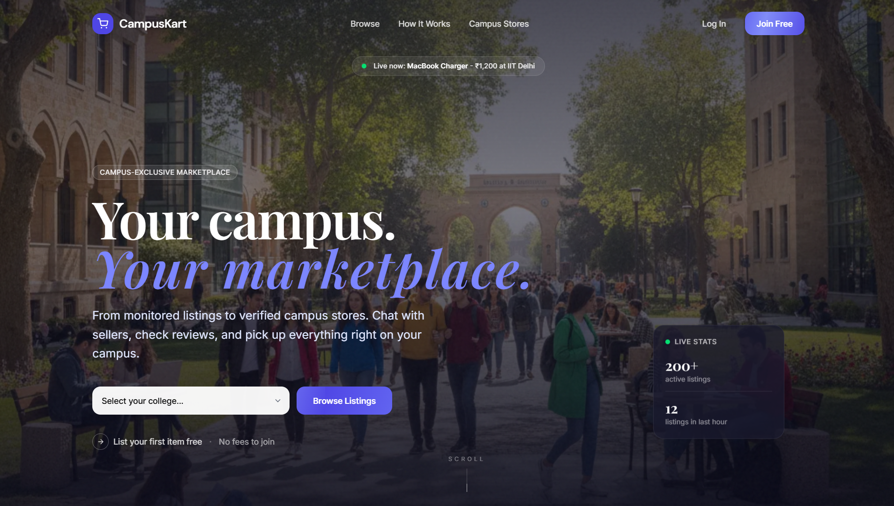
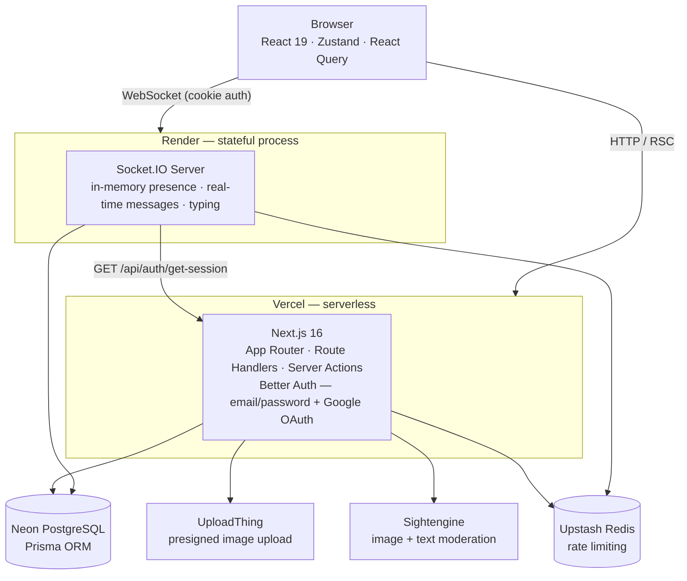

# CampusKart

A college-scoped marketplace for students — buy/sell items, browse campus stores, and chat with sellers in real time. Every listing, store, and conversation is scoped to the user's college. Cross-college data is never visible.

<p align="center">
  
</p>

---

## Architecture



---

## Features

| Feature | Status |
|---------|--------|
| Email/password + Google OAuth auth with college selection | ✅ |
| College-scoped listings (CRUD + image upload + moderation) | ✅ |
| Contact Seller → opens real-time chat thread | ✅ |
| Chat with store (in-app, find-or-create on first contact) | ✅ |
| Orders page (Selling / Buying derived lists + Mark as Sold) | ✅ |
| Real-time chat (messages, typing indicators, presence, unread counts) | ✅ |
| Delete-for-me (per-user conversation hide, resurfaces on new message) | ✅ |
| User profiles (own / public / edit + avatar) | ✅ |
| Campus Stores (browse, register, categories, tags, reviews, open hours) | ✅ |
| Admin panel (MODERATOR/ADMIN roles — remove listings, verify stores, mod log) | ✅ |
| Content moderation — image + text (Sightengine, synchronous, before DB insert) | ✅ |
| Rate limiting on auth, listing create, conversation create + socket messages (Upstash Redis) | ✅ |
| Fixed Price / Negotiable listing types (seller picks per listing) | ✅ |

---

## Tech Stack

| Layer | Technology |
|-------|-----------|
| Frontend + Backend | Next.js 16 App Router · TypeScript strict mode |
| Auth | Better Auth (email/password + username plugin, Prisma adapter) |
| Database | Prisma ORM + Neon PostgreSQL |
| Realtime | Socket.IO on a separate Express server (port 3001 locally, Render in prod) |
| UI | Tailwind CSS v4 + shadcn/base-ui primitives |
| Server state | React Query v5 (`@tanstack/react-query`) |
| Realtime state | Zustand (socket, onlineUsers, typingUsers only) |
| Forms | React Hook Form + Zod v4 (every form and mutation) |
| Image upload | UploadThing (presigned — bytes never touch our server) |
| Image moderation | Sightengine (synchronous, by image URL, before DB insert) |
| Image compression | browser-image-compression (client-side, before upload) |
| Rate limiting | Upstash Redis (`@upstash/ratelimit`, sliding window) |
| Deployment | Next.js → Vercel · Socket server → Render |

---

## Project layout

```
campuskart/
├── src/                        Next.js 16 app (Vercel)
│   ├── app/
│   │   ├── (auth)/             login, signup, complete-profile
│   │   ├── (app)/              protected shell
│   │   │   ├── listings/       browse, create, detail, edit
│   │   │   ├── stores/         browse, create, detail, edit
│   │   │   ├── chat/           conversation list + thread
│   │   │   ├── orders/         Selling & Buying lists
│   │   │   ├── profile/        own / public / edit
│   │   │   └── admin/          listings moderation, store verification, mod log
│   │   └── api/                Route Handlers (reads only)
│   ├── actions/                Server Actions (mutations)
│   ├── components/             UI components
│   ├── hooks/                  use-socket, use-chat
│   ├── stores/                 Zustand (socket-store)
│   ├── lib/                    auth, db, moderation, rate-limit, uploadthing, utils
│   └── types/                  Zod schemas + inferred types
├── socket-server/              Express + Socket.IO (Render)
│   └── src/
│       ├── index.ts            bootstrap + CORS + /health
│       ├── socket-handler.ts   all event handlers + in-memory presence
│       ├── auth-validator.ts   cookie session validation at handshake
│       ├── rate-limiter.ts     per-user message rate limit (Upstash)
│       └── types.ts            socket event interfaces
├── prisma/
│   ├── schema.prisma           source of truth for all DB models
│   └── seed.ts                 seed Indian colleges
├── tests/e2e/                  Playwright specs + DB seed helpers
└── docs/                       persistent documentation system
    ├── CODEBASE.md
    ├── ARCHITECTURE.md
    ├── API_FLOW.md
    ├── DECISIONS.md
    └── DEBUGGING.md
```

---

## Getting started

### Prerequisites
- Node.js 20+
- A [Neon](https://neon.tech) PostgreSQL database (two connection strings: pooled + direct)
- [UploadThing](https://uploadthing.com) account
- [Sightengine](https://sightengine.com) API credentials (free developer tier)
- [Upstash Redis](https://upstash.com) database

### 1. Install dependencies

```bash
# Next.js app
npm install

# Socket server
cd socket-server && npm install
```

### 2. Environment variables

**`.env.local`** (Next.js root):
```bash
DATABASE_URL=""              # Neon pooled connection string (pgbouncer)
DIRECT_URL=""                # Neon direct connection string (migrations only)
BETTER_AUTH_SECRET=""        # openssl rand -base64 32
BETTER_AUTH_URL="http://localhost:3000"
NEXT_PUBLIC_SOCKET_URL="http://localhost:3001"
UPLOADTHING_TOKEN=""
SIGHTENGINE_API_USER=""
SIGHTENGINE_API_SECRET=""
# Optional: SIGHTENGINE_MODELS="nudity-2.1,gore-2.0,offensive"
# Optional: SIGHTENGINE_THRESHOLD="0.5"
UPSTASH_REDIS_REST_URL=""
UPSTASH_REDIS_REST_TOKEN=""
```

**`socket-server/.env`** (separate process — does NOT inherit `.env.local`):
```bash
DATABASE_URL=""              # same Neon pooled string
DIRECT_URL=""
BETTER_AUTH_SECRET=""        # same secret
BETTER_AUTH_URL="http://localhost:3000"
PORT=3001
UPSTASH_REDIS_REST_URL=""
UPSTASH_REDIS_REST_TOKEN=""
```

### 3. Database setup

```bash
npx prisma db push          # sync schema to Neon (no migration files)
npx prisma db seed          # seed Indian colleges
```

### 4. Run locally

```bash
# Terminal 1 — Next.js app
npm run dev                  # http://localhost:3000

# Terminal 2 — Socket.IO server
cd socket-server && npm run dev   # http://localhost:3001
```

---

## Development commands

```bash
npx tsc --noEmit             # type-check (must be zero errors before committing)
npx prisma studio            # DB GUI at http://localhost:5555
npx prisma db push           # apply schema changes (this project uses db push, NOT migrate dev)
npx prisma db seed           # re-seed colleges
npx playwright test          # run E2E tests
```

> **Important:** after any `prisma db push` / `prisma generate`, restart both the Next.js dev server and the socket server — they cache the generated client in memory and won't pick up new fields via HMR.

---

## Architecture overview

See [ARCHITECTURE.md](./ARCHITECTURE.md) for the full design. Short version:

- **Reads** → `src/app/api/**` Route Handlers, consumed by React Query on the client.
- **Mutations** → `src/actions/**` Server Actions, returning typed `ApiResponse<T>`.
- **Realtime** → Socket.IO events only, never HTTP.
- **College scoping** → `collegeId` always comes from `session.user.collegeId`, never the client payload.
- **Socket `senderId`** → always `socket.data.userId` set during handshake; never trusted from the event payload.
- **Two deploy targets** → Next.js on Vercel (serverless, no persistent connections); Socket.IO server on Render (stateful process, holds presence maps).

---

## Role-based access

| Role | What they can do |
|------|-----------------|
| `USER` | everything in the app — list items, browse stores, chat |
| `MODERATOR` | all USER actions + admin panel for their own college (remove listings, verify/archive stores) |
| `ADMIN` | all MODERATOR actions across all colleges + moderation log + permanent store deletion |

Roles are set directly in the DB (`User.role`). The admin panel is at `/admin`.

---

## What's left to do

| Item | Notes |
|------|-------|
| **E2E gaps** | `tests/e2e/stores.spec.ts` already covers stores browse/create/validation **and** admin verification. Not yet covered: store **detail** page, reviews, and the new store-chat path. |
| **Vercel + Render deployment** | Environment variables need to be set on both platforms; CORS on the socket server must point at the Vercel URL |

---

## Key files reference

| File | Purpose |
|------|---------|
| [prisma/schema.prisma](prisma/schema.prisma) | source of truth for all DB models |
| [src/lib/auth.ts](src/lib/auth.ts) | Better Auth server config |
| [src/lib/auth-client.ts](src/lib/auth-client.ts) | Better Auth browser client |
| [src/lib/db.ts](src/lib/db.ts) | Prisma singleton (PrismaPg + pg Pool for Neon) |
| [src/lib/moderation.ts](src/lib/moderation.ts) | Sightengine image moderation wrapper (with retry) |
| [src/lib/rate-limit.ts](src/lib/rate-limit.ts) | Upstash ratelimit factory functions |
| [src/lib/socket-client.ts](src/lib/socket-client.ts) | Socket.IO browser client singleton |
| [src/proxy.ts](src/proxy.ts) | auth cookie gate + auth-endpoint rate limiting (Next.js 16 `proxy`, formerly `middleware.ts`) |
| [src/stores/socket-store.ts](src/stores/socket-store.ts) | Zustand store (socket, onlineUsers, typingUsers) |
| [socket-server/src/index.ts](socket-server/src/index.ts) | Express + Socket.IO bootstrap |
| [socket-server/src/socket-handler.ts](socket-server/src/socket-handler.ts) | all socket event handlers |
| [docs/](docs/) | persistent architecture and decision documentation |
